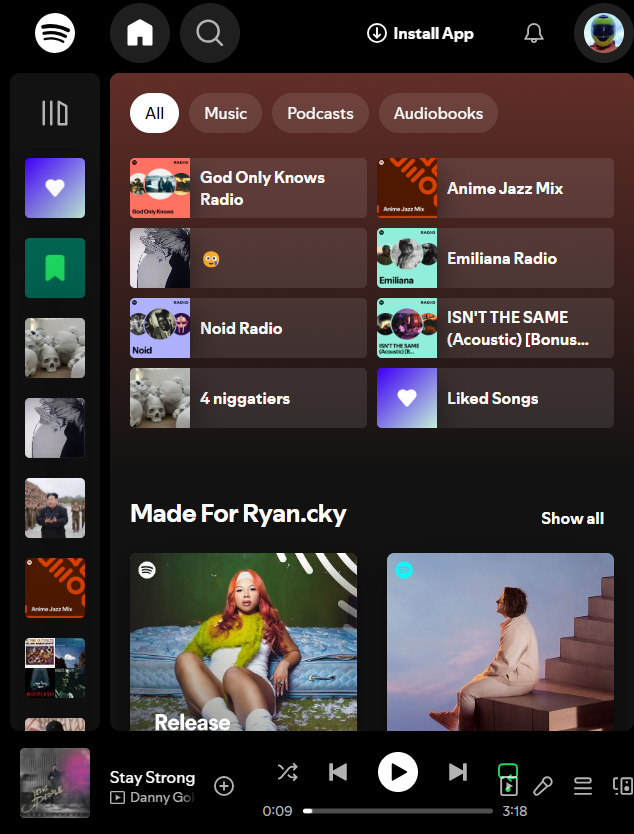
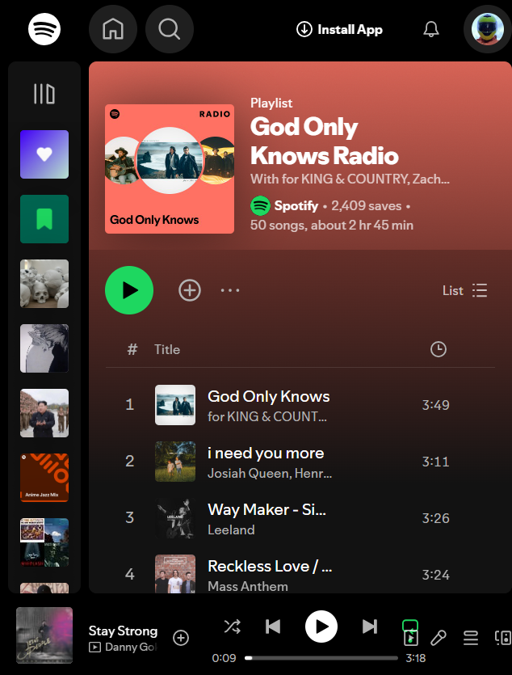
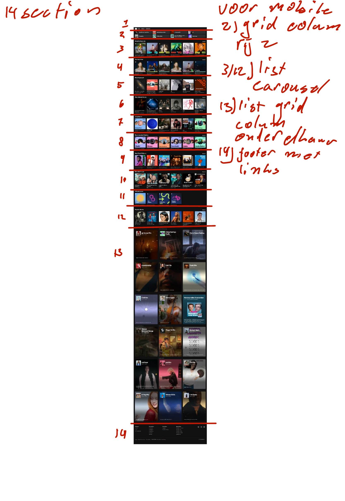
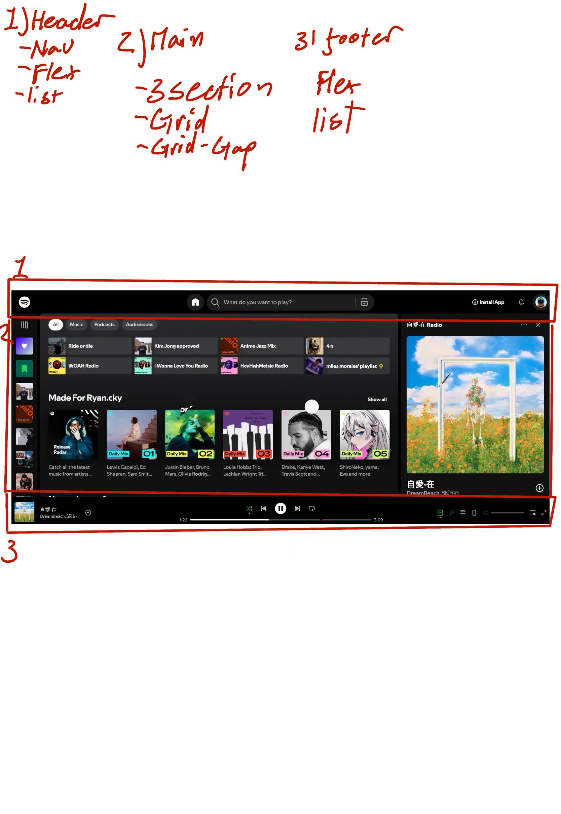
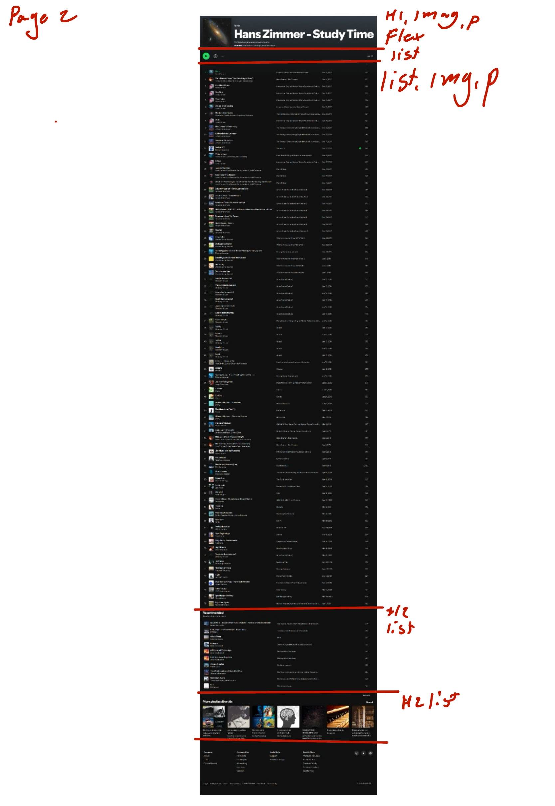

# Procesverslag
Markdown is een simpele manier om HTML te schrijven.  
Markdown cheat cheet: [Hulp bij het schrijven van Markdown](https://github.com/adam-p/markdown-here/wiki/Markdown-Cheatsheet).

Nb. De standaardstructuur en de spartaanse opmaak van de README.md zijn helemaal prima. Het gaat om de inhoud van je procesverslag. Besteedt de tijd voor pracht en praal aan je website.

Nb. Door *open* toe te voegen aan een *details* element kun je deze standaard open zetten. Fijn om dat steeds voor de relevante stuk(ken) te doen.

## Jij

  
uitwerken voor kick-off werkgroep

  ### Auteur:
 Ryan yeung
  #### Je startniveau:
  rood

  #### Je focus:
  Main focus survice plain probeer ook repsonsifness bij te p[akken]
 

## Je website

  
uitwerken voor kick-off werkgroep

  ### Je opdracht:
https://open.spotify.com/playlist/37i9dQZF1E8RZQSx3O0OCQ

  #### Screenshot(s) van de eerste pagina (small screen): 
  spotify home pagina
  

  #### Screenshot(s) van de tweede pagina (small screen):
  spotify playlist pagina
  
 

## Toegankelijkheidstest 1/2 (week 1)

  
uitwerken na test in 2e werkgroep
 wat moet ik hier doen?  

  ### Bevindingen
  Lijst met je bevindingen die in de test naar voren kwamen:

## Breakdownschets (week 1)

  
uitwerken na afloop 3e werkgroep

  ### de hele pagina: 
  

  ### dynamisch deel (bijv menu): 
  

  ### wellicht nog een dynamisch deel (bijv filter): 
  

## Voortgang 1 (week 2)

  
uitwerken voor 1e voortgang

  ### Stand van zaken
  hier dit ging goed & dit was lastig (neem ook screenshots op van delen van je website en code)

  ### Agenda voor meeting
  samen met je groepje opstellen

  | ryan   | student 2          | student 3    | student 4        |
  | ---            | ---                | ---          | ---              |
  | dit bespreken  | en dit             | en ik dit    | en dan ik dat    |
  | en dat ook nog | dit als er tijd is | nog een punt | dit wil ik zeker |
  | ...            | ...                | ...          | ...              |

  ### Verslag van meeting
  hier na afloop snel de uitkomsten van de meeting vastleggen

  - maak eerst mobile first
  - verbetr/ maak breakdown schets af
  - begin stap voor stap, ipv ergens in het midden of alles tegelijker tijd te maken. Focus op 1 gedeelte dan het ander
  - 

## Voortgang 2 (week 3)

  
uitwerken voor 2e voortgang

  ### Stand van zaken
  hier dit ging goed & dit was lastig (neem ook screenshots op van delen van je website en code)

  ### Agenda voor meeting
  samen met je groepje opstellen

  | ryan      | quincy          | student 3    | student 4        |
  | ---            | svg gebruik, erin voegen. In script werken button erin verwerken. hoe geven we een button play functie. hoe geven we pause functie             | ---          | ---              |
  | dit bespreken  | en dit             | en ik dit    | en dan ik dat    |
  | en dat ook nog | dit als er tijd is | nog een punt | dit wil ik zeker |
  | ...            | ...                | ...          | ...              |

  ### Verslag van meeting
  hier na afloop snel de uitkomsten van de meeting vastleggen

  - punt 1
  - punt 2
  - nog een punt
- ...

## Toegankelijkheidstest 2/2 (week 4)

  
uitwerken na test in 9e werkgroep

  ### Bevindingen
  Lijst met je bevindingen die in de test naar voren kwamen (geef ook aan wat er verbeterd is):

## Voortgang 3 (week 4)

  
uitwerken voor 3e voortgang

  ### Stand van zaken
  hier dit ging goed & dit was lastig (neem ook screenshots op van delen van je website en code)

  ### Agenda voor meeting
  samen met je groepje opstellen

  | student 1      | student 2          | student 3    | student 4        |
  | ---            | ---                | ---          | ---              |
  | dit bespreken  | en dit             | en ik dit    | en dan ik dat    |
  | en dat ook nog | dit als er tijd is | nog een punt | dit wil ik zeker |
  | ...            | ...                | ...          | ...              |

  ### Verslag van meeting
  hier na afloop snel de uitkomsten van de meeting vastleggen

  - punt 1
  - punt 2
  - nog een punt
  - ...

## Eindgesprek (week 5)

  
uitwerken voor eindgesprek

Dit was een uitdagend project dat me zowel mijn codeer vaardigheden op de proef heeft gesteld.

Het proces van het bouwen van de spotify clone was allesbehalve makkelijk. Ik heb veel zoals het begrijpen van complexe frameworks, het toevoegen en verbeteren van een responsive design, het omgaan met flex en grid en waar ik het meest waarde aanhecht is dat ik heb geleerd hoe ik zo een groot project moet delen in kleinere stukken en hoe ik mijn werkwijze voor dit kan verbteren. Want hiervoor was mijn werkwijze erg rommelig en onoverzichtelijk, ik weet zeker dat bij mijn volgende project ik veel praktischer en netter kan werken. Ondanks de moeilijkheden ben ik blij dat ik deze uitdaging ben aangegaan. 

IEts waar ik ook tegen aan liep, was de tijdslimiet. Ik denk dat met meer tijd tijdens de lesuren ik mijn proces had kunnen verbeteren en misschien een nog een betere eindproduct had kunnen opleveren. Toch ben ik trots op wat ik heb bereikt in de beschikbare tijd.

ik ben het meest tevreden met, het gevoel dat ik mezelf heb uitgedaagd. Ik koos bewust voor een moeilijk project, omdat ik wist dat ik veel meer zou leren dan wanneer ik voor een simpelere optie had gekozen. Uiteindelijk denk ik dat dit de juiste keuze was, omdat ik niet tevreden zou zijn geweest met een project waar ik minder moeite voor had hoeven doen.

Dit project heeft me niet alleen nieuwe technische vaardigheden geleerd, maar me ook laten inzien hoe belangrijk het is om jezelf uit je comfortzone te halen. Ik kijk ernaar uit om deze ervaring mee te nemen naar toekomstige projecten en mezelf steeds verder te blijven uitdagen.

## Bronnenlijst

  
continu bijhouden terwijl je werkt

  Nb. Wees specifiek ('css-tricks' als bron is bijv. niet specifiek genoeg). 
  Nb. ChatGpT en andere AI horen er ook bij.
  Nb. Vermeld de bronnen ook in je code.

  1. chatgpt
  2. https://codepen.io/ryanhva/pen/pvzxNdY
  3. https://www.w3schools.com/howto/tryit.asp?filename=tryhow_css_button_on_image
  4. https://css-tricks.com/almanac/properties/p/position/
  5. https://www.svgrepo.com/svg/524226/add-circle
  6. https://app.aiseo.ai/tools/youtube-to-mp3
  7. https://codepen.io/ryanhva/pen/gbYdNWE
  8. https://codepen.io/ryanhva/pen/vEBzqJV
  9. https://www.youtube.com/watch?v=i3Sl-Ns0O7o&t=3351s
  10. https://www.youtube.com/watch?v=DvBe6z9vhfU&t=377s 

